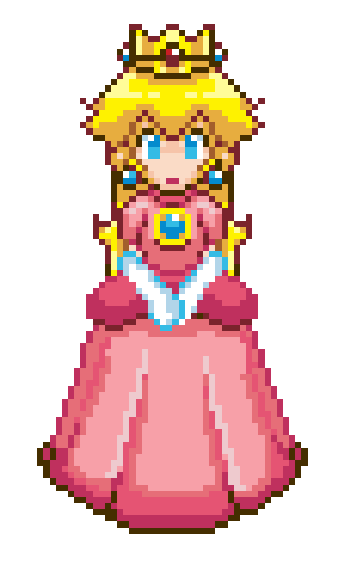

 

---

## about me

<table border="0" cellspacing="0" cellpadding="0" style="border: none; border-collapse: collapse;">
  <tr>
    <td style="padding: 16px 24px; background: #faf0f5; border-radius: 16px; box-shadow: 0 4px 12px rgba(0,0,0,0.06);">
      

        💗 делаю маленькие HTML/CSS-проекты 
        💗 изучаю основы Python и JavaScript 
        💗 собираю первое приложение на React Native 
        💗 пишу посты для начинающих в тгк 
        💗 разбираюсь в game studies
      

    </td>
    <td style="padding: 16px 24px; background: #faf0f5; border-radius: 16px; box-shadow: 0 4px 12px rgba(0,0,0,0.06);">
      

        
      

    </td>
  </tr>
</table>

